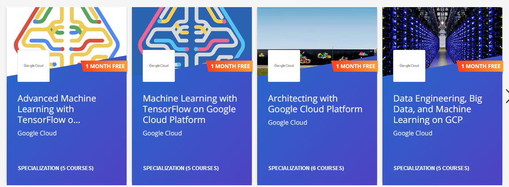

# Architecting with Google Cloud Platform

https://google.qwiklabs.com/courses/844      

https://www.coursera.org/specializations/gcp-architecture     

##  [### Google Cloud Platform Fundamentals: Core Infrastructure](https://www.coursera.org/learn/gcp-fundamentals?specialization=gcp-architecture)
### Introducing Google Cloud Platform
### Getting Started with Google Cloud Platform
### Virtual Machines in the Cloud
### Storage in the Cloud
### Containers in the Cloud
### Applications in the Cloud
### Developing, Deploying and Monitoring in the Cloud
### Big Data and Machine Learning in the Cloud
### Summary and Review

##  [### Essential Cloud Infrastructure: Foundation](https://www.coursera.org/learn/gcp-infrastructure-foundation?specialization=gcp-architecture)
### Welcome to Cloud Infrastructure on Google Cloud Platform
### Module 1: Introduction to Google Cloud Platform Infrastructure
### Module 2: Virtual Networking
### Module 3: Virtual Machines

##  [### Essential Cloud Infrastructure: Core Services](https://www.coursera.org/learn/gcp-infrastructure-core-services?specialization=gcp-architecture)
### Welcome to Essential Cloud Infrastructure: Core Services
### Module 1: Cloud IAM
### Module 2: Data Storage Services
### Module 3: Resource Management
### Module 4: Resource Monitoring

## [Elastic Cloud Infrastructure: Scaling and Automation](https://www.coursera.org/learn/gcp-infrastructure-scaling-automation?specialization=gcp-architecture)

### Welcome to Elastic Cloud Infrastructure: Scaling and Automation
### Module 1: Interconnecting Networks
### Module 2: Load Balancing
### Module 3: Autoscaling
### Module 4: Infrastructure Automation with Cloud API
### Module 5: Infrastructure Automation with Deployment Manager
### Module 6: Managed Services

##  [### Elastic Cloud Infrastructure: Containers and Services](https://www.coursera.org/learn/gcp-infrastructure-containers-services)

### Welcome to Elastic Infrastructure: Containers and Services
### Module 1: Application Infrastructure Services
### Module 2: Application Development Services
### Module 3: Containers

##  [### Reliable Cloud Infrastructure: Design and Process](https://www.coursera.org/learn/cloud-infrastructure-design-process)

### Welcome to Design and Process
### Defining the Service
### Business-logic Layer Design
### Data Layer Design
### Presentation Layer
### Design for Resiliency, Scalability, and Disaster Recovery
### Design for Security
### Capacity Planning and Cost Optimization
### Deployment, Monitoring and Alerting, and Incident Response

# **Free Course on Coursera **
https://www.coursera.org/promo/NEXTExtended  

#  **Good Course**

https://www.coursera.org/specializations/gcp-architecture

https://www.coursera.org/specializations/gcp-data-machine-learning

https://www.coursera.org/specializations/machine-learning-tensorflow-gcp  

https://www.coursera.org/specializations/advanced-machine-learning-tensorflow-gcp   

#  cloud-architect

https://cloud.google.com/certification/

## introduction

https://cloud.google.com/certification/cloud-architect

**https://www.coursera.org/specializations/gcp-architecture**

https://google.qwiklabs.com/courses/844

https://www.coursera.org/specializations/gcp-architecture
https://www.coursera.org/specializations/architecting-google-kubernetes-engine

## all Course by Google Cloud

https://www.coursera.org/instructor/google-cloud-training

 
