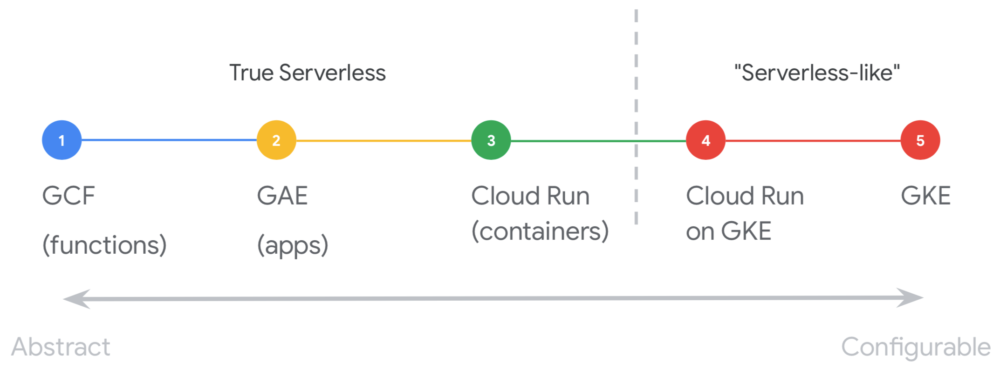

# Serverless Product




#  events.


https://cloud.google.com/blog/topics/training-certifications/get-google-cloud-certified-at-next-19-what-you-need-to-know?utm_medium=email&utm_source=other&utm_campaign=partner.443.opencourse.targetedmessages.marketing~partner.443.83bvhyA-EemUGhIv8FOzUg


https://cloudonair.withgoogle.com/events/americas?utm_source=google&utm_medium=blog&utm_campaign=FY19-Q1-americas-onair-website-er-blog_mar8_security_gcp&utm_content=product_marketing


#  gcp frerelab
https://cloud.google.com/training/free-labs/


## 学习资源：

###   archtect
https://inthecloud.withgoogle.com/onboard/global-classic.html

### big data & machine-learning
https://inthecloud.withgoogle.com/onboard/global-machine-learning.html

# gke


## Create a Project 


## config env

```
gcloud init


gcloud config set compute/region us-west1


gcloud config set compute/zone us-west1-c

```


## create a k8s cluster 


```
# Create a cluster
gcloud container clusters create  my-first-cluster

# config the kubectl
gcloud container clusters get-credentials my-first-cluster


# Deploy an App
kubectl run hello-server --image gcr.io/google-samples/hello-app:1.0 --port 8080


# Delete the Cluster
gcloud container clusters delete  my-first-cluster

```
